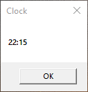

# Clock

A simple VBScript program that displays the current time.

## Description

Clock is a small program written in VBScript that displays the current time when the program is opened. It provides a convenient way to quickly check the time without needing to open a separate application.

## Features

- Displays the current time in a pop-up window.
- Easy to use and lightweight.

## Usage

1. Ensure that you have VBScript installed on your system.
2. Download the `Clock.vbs` file from this repository.
3. Double-click on the `Clock.vbs` file to run the program.
4. A pop-up window will open, showing the current time.

## Example

